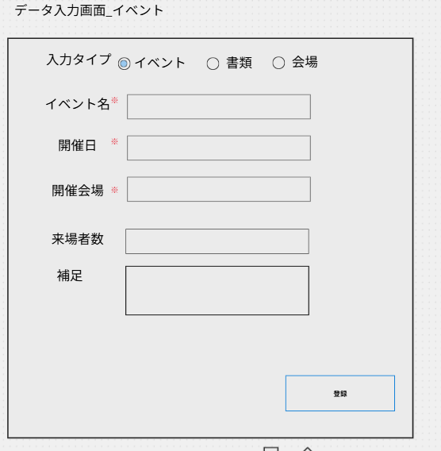
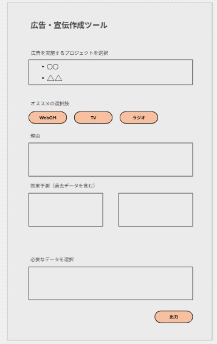

# システム 基本設計（サンプル）
## 画面設計
### 画面レイアウト
#### マネジメント画面#1

#### データ入力画面#2
イベント入力画面、メールデータ入力画面、ファイルデータ入力画面、ファイルデータ入力画面、ファイルデータ入力画面

#### フォーマット作成画面#3

#### データ編集画面#4

### 画面遷移

**マネジメント画面#1**
- 各画面(#2~4)に遷移

**データ入力画面#2**
- イベント入力画面(#2-1)
    - 画面上部のラジオボタンににて#2-2に遷移
- 書類（メール）入力画面(#2-2)
    -  ラジオボタンの下のボタンにて#2-3に遷移
- 書類（申請書類・連絡）入力画面(#2-3,2-4)
- 新規会場登録画面(#2-5)

### 入出力項目定義
#### イベントデータ入力画面#2-1
**項目**
- イベント名 [必須]
    - 1行のテキストボックス
- 開催日 [必須]
    - YYYY/MM/DD形式
- 来場者数
    - number形式
    - 上限なし
- 補足
    - テキストフィールド　100文字程度？

**バリデーション**
- 来場者数
    - 0以上
- 開催日
    - 今日以前

#### メールデータ入力画面#2-2
**項目**
- タイトル名 [必須]
    - 1行のテキストボックス
- 宛先[必須]
    - String
- 内容[必須]
    - number形式
    - 上限なし
- ファイル
    - テキストフィールド　100文字程度？

#### ファイルデータ入力画面#2-3
**項目**
- タイトル名 [必須]
    - 1行のテキストボックス
- 宛先[必須]
    - string
- 内容[必須]
    - number形式
    - 上限なし
- ファイル
    - テキストフィールド　100文字程度？

#### ファイルデータ入力画面#2-4
**項目**
- タイトル名 [必須]
    - 1行のテキストボックス
- 宛先[必須]
    - string
- 内容[必須]
    - number形式
    - 上限なし
- ファイル
    - テキストフィールド　100文字程度？

#### ファイルデータ入力画面#2-5
**項目**
- タイトル名 [必須]
    - 1行のテキストボックス
- 宛先[必須]
    - string
- 内容[必須]
    - number形式
    - 上限なし
- ファイル
    - テキストフィールド　100文字程度？

#### フォーマット作成画面#3
**項目**
- よく利用するフォーマットボタン（任意）
    - メール
    - 申請書類
    - 連絡
    - AIとチャット
   - エディタ
- 出力方法選択ボタン
    - Word
    - PDF    
#### エラー画面
- どんな場面でエラーが発生するか
    - 入力がない、不正な入力
    - RAGにアクセスできない
    - タイムアウト
## 外部インターフェース
### APIリスト一覧
#### 候補日ボタン押下
##### GET /input/event
イベントのRagに情報を入力し、DBに登録する。 

**Request**
- イベント名：title :number 
- イベントの開催日：held_on :date 
- 会場ID：venue_id :number 
- 備考：input_text :string 

**Response**
- 200 OK
    - Message：登録成功
- 400 BadRequest
    - 会場、自治体IDが不正
    - 返却データなし
- 500 BadRequest
    - DBサーバがダウンしている
    - 返却データなし   

##### GET /input/mail
イベントのRagに情報を入力し、DBに登録する。 

**Request**
- イベント名：title :number 
- イベントの開催日：held_on :date 
- 会場ID：venue_id :number 
- 備考：input_text :string 

**Response**
- 200 OK
    - Message：登録成功
- 400 BadRequest
    - 会場IDが不正
    - 返却データなし
- 500 BadRequest
    - DBサーバがダウンしている
    - 返却データなし   

##### GET /input/file

**Request**
- タイトル名：file_title :string
- 宛先：adress :string 
- 本文：content :string 
- ファイル： file_url: s3で管理
- 備考：input_text :string 

**Response**
- 200 OK
    - Message：登録成功
- 400 BadRequest
    - 会場IDが不正
    - 返却データなし
- 500 BadRequest
    - DBサーバがダウンしている
    - 返却データなし   

##### GET /input/venue

**Request**
- タイトル名：file_title :string
- 宛先：adress :string 
- 本文：content :string 
- ファイル： :file 
- 備考：input_text :string 

**Response**
- 200 OK
    - Message：登録成功
- 400 BadRequest
    - 会場IDが不正
    - 返却データなし
- 500 BadRequest
    - DBサーバがダウンしている
    - 返却データなし   

##### GET /setting
DBからragがイベントの候補日、開催地、予算、イベント名と詳細を提案する。 

**Request**
- 予算希望：number[0, inf] 
- 日時希望： date、今日以降 
- 会場希望：number 

**Response**
- 200 OK 
  - 予算候補リスト：number[]
  - 日時候補リスト：date[]
  - 会場候補リスト：number[]
  - イベント名候補：text[]
  - イベント説明：text[]

- 400 Bad Request 
  - 入力値が不正な場合 
  - 返却データなし 

##### GET /format
ragが考案したフォーマットを出力する。

**Request**
 - 利用するフォーマット（メール・申請書類・連絡・null）:　string 
 - 類似した過去の資料を提案：AIが必要だと判断したキーワードから検索する。
 - AIとチャット：string（利用するフォーマットが含まれる場合も）。

**Response**
 - 200 OK 
     - 資料のURLリスト：text[]
     - AIが作成したフォーマット：text 
- 400 Bad Request 
  - 入力データがありませんでした
- 500 ServerError 
  - サーバーエラー 
## データモデル設計
### テーブル設計

